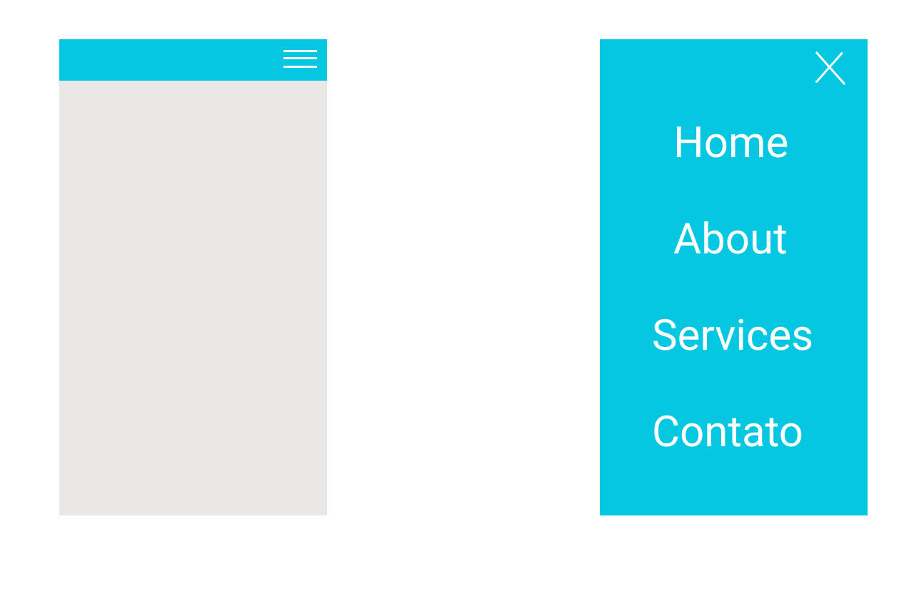

# Menu responsivo
Esse exercício tem como intuito aprender a fazer um menu responsivo

    

## Paleta de cores

    

## Tecnologias utilizadas

| Tecnologias | Para estudos |
| ------ | ------ |
| HTML | https://developer.mozilla.org/pt-BR/docs/Aprender/Getting_started_with_the_web/HTML_basico
| CSS | https://developer.mozilla.org/en-US/docs/Learn/Getting_started_with_the_web/CSS_basics
| JavaScript | https://developer.mozilla.org/en-US/docs/Web/javascript

## Propriedades de CSS usadas

- [Box model](https://www.youtube.com/watch?v=nhW70H9H4gU);
- [Background](https://maujor.com/tutorial/propriedade-css-para-estilizacao-de-background.php);
- [FlexBox](https://origamid.com/projetos/flexbox-guia-completo/);
- [Height](https://maujor.com/tutorial/propriedade-css-height.php);
- [Width](https://maujor.com/tutorial/propriedade-css-width.php);
- [Font](https://developer.mozilla.org/en-US/docs/Web/CSS/font-size);
- [Links](https://css-tricks.com/css-basics-styling-links-like-boss/);
- [Position](https://www.w3schools.com/Css/css_positioning.asp);
- [Z-index](https://www.w3schools.com/cssref/pr_pos_z-index.asp);
- [Transition](https://developer.mozilla.org/en-US/docs/Web/CSS/CSS_Transitions/Using_CSS_transitions);
- [Transform](https://developer.mozilla.org/en-US/docs/Web/CSS/transform);
- [Line-height](https://maujor.com/tutorial/propriedade-css-line-height.php);

## Metódos de responsividade

- [Media queries](https://developer.mozilla.org/en-US/docs/Web/CSS/Media_Queries/Using_media_queries)

## Referência de menu

[Rocketseat](https://www.youtube.com/watch?v=H91DhKPjhPk)

Autora
----

Desenvolvido por [Yasmim Barbosa Vieira](https://www.linkedin.com/in/yasmim-barbosa/) - Desenvolvedora Front-end